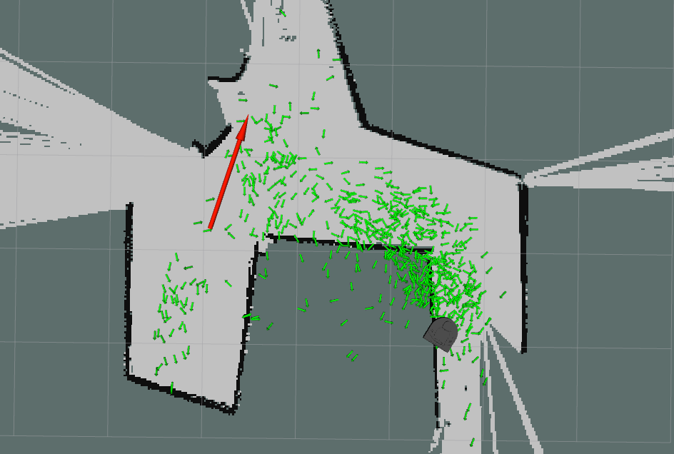

<!-- 

Additionally, you can see in the gif that the particle filter can get tripped up with similar locations in that it got stuck between locating the robot at the ends of the hallways in the designated map. This is caused from the particle filter not having enough information to distinguish effectively between the two locations, where implementations which feature an initial pose do not tend to run into multiple similar conditions because they have the extra information of a starting point which will exclude possible 'similar solutions' found elsewhere in the map. -->

# Robot Localization

Here we see robot localization at work! Read on to understand what's happening here.

## Intro

This is a forked repo for the Olin Computational Robotics Robot Localization project. The authors of this write-up and implementation are:

[Timothy Novak](https://github.com/tnovak-olin)

[Everardo Gonzalez](https://github.com/EverardoG)

The goal of this project was to develop a particle filter which would allow a robot to locate itself in an environment where it has a pre-existing map of the sensor readings in the environment.

## Table of Contents

[Overview](#Overview)

[Our Approach](#Our-Approach)

[Performance](#Performance)

[Design Decisions](#Design-Decisions)

[Challenges](#Challenges)

[Lessons Learned](#Lessons-Learned)

[If We Had More Time...](#If-We-Had-More-Time...)

<!-- How to insert gifs:  -->

## Overview

The particle filter generates a collection of possible locations in the map that the robot could be. The particle filter then compares the sensor readings at each of these locations to the map and its own sensors to determine how 'likely' the robot is to be at each of these locations. The particle filter weights the possible locations to represent this likelihood. Then the particle filter generates a new set of possible locations around the highest weighted points from the previous round. The robot then moves around its environment and the particle filter computes where each possible location would be based on the movement the robot just executed. The particle filter then repeats the process by comparing the robot's sensor values to those at each of the possible locations.

Over time the robot's possible positions estimates will converge on the most probable locations for the robot to be in the map with possible location estimates 'clustering around the most probable robot locations.

Our goal was to implement one of one of these particle filters.

## Our Approach

We broke down our particle filter into high level steps for the *Initialization* of the particle filter and the *Main Loop* that ran once the particle filter was initialized.

## Initailization

1. Distribute initial particles accross the whole space in a uniform, psuedo-random fashion. Each particle has a pose and weight associated with it. Each weight is initalized to 0.

## Main Loop
1. Assign an un-normalized weight to each particle based on it's lidar scan.
    1. Project the robot's actual lidar scan from the particle's frame.
    2. Get the distance from each projected lidar scan point to the closest obstacle in the map.
    3. Sum all of those distances.
    4. The un-noramlized weight of that particle is the inverse of the sum of the distances.
2. Normalize the weights so that each weight ranges from 0 to 1, and the sum of all weights is 1.
3. Resample the particles so that the lower weighted particles are redistributed around the highest weighted particles with some variation in pose.
4. Update each particle pose based on the robot's odometry readings.
    1. Align the "0 point" for the robot odometry angle and the particle angle.
    2. Calculate the difference in angle between odometry and the particle.
    3. Transform the change in the odometry's x and y so that the particle moves relative to its pose in the same way the robot moved relative to the robot's pose.
5. Update the map to odom transform that represents our best estimate of where the robot is in the map. Set the estimate equal to the pose of the particle with the highest weight.

## Performance
We tested our particle filter on four distinct maps, and visualized its performance in `rviz`. The bag files for each test are found [here](https://github.com/EverardoG/robot_localization/tree/primary/robot_localizer/bags) as `robot_localizer/bags/ac_x_test.bag`. If you want to visualize these tests yourself, you can do so by running the bag file, running rviz, and adding the following topics:

- /hypotheses
- /map_pose
- /map
- RobotModel (add by display type)

 We can see here an explanation of what's happening in each visualization.

<!--  -->

Key:

- Black lines represent walls
- Grey tiles represent the floor
- Red arrow represents where the robot is
- Green arrows represent hypotheses as to where the robot _could_ be
- The brighter the arrow, the better the hypothesis!
- Robot Model represents where the robot _probably_ is

### Map 1: ac109_1

Here we can see that a bunch of particles begin completely outside of the bounds of the map, but they quickly converge to areas within the map. We also see this interesting behavior where the particles move towards two primary maximas where the robot is most likely to be. The particles at first tend to cluster around the wrong local maxima, but because our particle filter is not highly aggressive in its resampling, the two clusters can coexist without either dissappearing _until_ the particle filter has enough data to be certain that one of the clusters is far more probable. At that point, the two states collapse on where the robot actually is. Once the particle filter finds the robot, it seems to follow it quite well, with any particles that deviate too far from the robot being marked with a dark green, indicating that the particle filter knows that these particles are not accurate.

### Map 2: ac109_2

In this case, we again see the initial distribution of particles quickly converge to be within the bounds of the map. The biggest difference is that instead of us seeing two distinct clusters form as the particle filter attempts to localize, what we see looks far more like a long cluster of points that follows the path of the robot. Since the hallway is more or less similar in various areas of the map, this behavior makes a lot of sense. There aren't various highly distinct locations where the robot could be. There's one main corridor and the robot is _somewhere_ in that corridor. It's interesting that the particle filter becomes highly certain and highly accurate when the robot makes it all the way to the bottom right side, and it begins turning. This also makes sense as that section of the map is the most unique relative to the other locations the robot had explored. Thus, once the particle filter saw scans that matched that part of the map, it became highly certain that's where the robot was.

### Map 3: ac109_3

This was certainly one of the most challenging maps for our partcle filter. Not a single particle was initialized with a similar pose as the actual pose of the robot. In the previous maps, there were at least a few particles that were close to the actual pose of the robot, making it so that at least one initial guess was quite close. On this one however, not a single guess was even close. Since our algorithm for determining particle weight only looks at a summed set of differences lidar points and map points, it doesn't have much context for things like corners, wall angles, and slanted lines. Since all the map points are so close to every particle, every particle seems about as accurate as the next. This, combined with the poor particle initialization, leads the particle filter to initially place its best guess in entirely the wrong place. This makes sense, as it didn't have the chance to explore the space that the robot was actually in yet, and the space it found seemed pretty similar to the space the robot was in. However, once the robot started moving around the space, a few particles picked up on the robot's actual pose and slowly drew other particles towards themselves until eventually, the entire population of particles flowed to aligning themselves with the actual pose of the robot. It seems that our particle filter _will_ converge on the pose of the robot, even given poor initial conditions, so long as it has enough time to converge. Otherwise, without a decent first guess, the particle filter can't converge quickly.

### Map 4: ac109_3

This is our particle filter's worst nightmare. There are many similar looking areas, and the particles are mostly initialized in areas that seem like good estimates, even though they really aren't. With so much open space in this map, the particle filter is forced to make assumptions about what is actually in the environment, and can't find any good, unique areas to latch onto for hints. Near the end, the particles almost converge on the robot's actual position, but it all turns out to be fruitless as moving in the opposite direction seemed even more probable.

## Design Decisions
Particle filters of this type are usually used to refine a robot's position and compensate for drift They often require an initial pose estimate, an estimate which represents an approximation of the robots location and orientation in the map. We wanted the robot to be able to localize itself in its environment without any estimate of its initial pose. To accomplish this, we distributed particles uniformly across the map at the beginning of localization. This then describes the state that the robot could be anywhere in the map with similar likelihood before it can collapse its particle cloud down to a smaller set of locations.

Because we chose to have a more generalized localization approach our algorithm takes longer to converge before it discovers the true location of the robot. We traded speed for generalization.

Another important decision we made revolved around how we would develop our code. We decided that we wanted to visualize our particle filter as we developed it so that we could be certain each piece was behaving as expected. In this case, we traded development time for peace of mind, and in some cases, development time that would have been spent debugging.

## Challenges

We faced several challenges in implementing our particle filter. Some of our biggest challenges revolved around visualizing lidar data, making sure poorly weighted particles were being resampled, and moving particles according to odom appropriately.

## Lidar Visualization Challenges
We approached the building of our filter quite methodically. When we got a step working, we wanted to be certain that it was working. Alternatively, if it wasn't working, we wanted to have robust tools to help us debug why it wasn't working. This meant that we needed to build robust tooling infrastructure into our code so that we could easily debug our code and build an intuition for why it was, or wasn't working.

The major drawback of this approach is that we needed to take time to properly build out this tooling. In the case of visualizing lidar data and projected lidar data, we learned that rviz is not always intuitive.

In our first approach, we integrated a publisher into our main loop that would build up a `MarkerArray` of lidar points reconstructed as `Marker`s, and publish it to the _hypotheses_visualization_ topic for visualizing. We noticed that sometimes, scan points would remain visible in rviz for many frames after their corresponding scan had been published.  After lots of time spent searching for answers on the internet, we found that rviz implictly exepcts a `MarkerArray` to be the same size every time that rviz visualizes the `MarkerArray`. This was a problem for us since our `MarkerArray` was dynamically sized based on how many lidar scan points were in range of the lidar to accurately measure. We solved this by adding placeholder `Marker`s set as `DELETE` markers whenever our `MarkerArray` has less than 360 points. In our case 360 points represents a full lidar scan.

This temporarily seemed to completely resolve our visualization problems with the lidar. However, as we developed our code further, we realized that rviz was still displaying `Marker`s from different `MarkerArray`s at the same time. We went directly to Paul for help, having already invested time into debugging this the first time around. Paul taught us that we also had to be careful about the timestamp we assigned to each `Marker`, as rviz also expected that all `Marker`s in a `MarkerArray` all have the same timestamp associated with them. This was the root of our problem. When we constructed our lidar point `Marker`s, we assigned the `Marker` a timestamp based on when it was created. After our conversation with Paul, we switched this so that each `Marker`'s timestamp was synced to the timestamp of the last lidar scan message that was processed.

## Resampling and Odom Challenges
For our first pass at resampling, we tried to cluster lower weighted particles around higher weigted particles such that particles with higher weights would have more points clustered around them than particles with lower weights. At the same time, we had just implemented our update for moving the particles according to the robot's odometry updates.

These were the last two pieces of our particle filter, so we decided to plug them directly into our particle filter to see how the whole system would act. We were excited to see all the pieces work together. Unfortunately, we noticed two key giveaways that there was something wrong.

1. All of the low weight particles that never seemed to actually be resampled around high weight particles. To give a sense of scale, these particles were a whole five meters off the map in some cases, so they should have been resampled quickly.

2. The particles seemed to spread out arbitrarily whenever the robot moved. Instead of generally following the motion of the robot, particles would sometimes follow the robot, and sometimes fly off into the void of rviz.

The first behavior seemed to be directly due to how we were resampling our particles. Either our visualization was broken, or our resampling process was broken. We inspected this by checking how many particles were actually being resampled. Out of the expected 500 particles that should have been resampled, only 2 were actually being resampled. To resolve this, we switched to a simpler resampling implementation that uniformly distributed the worst 500 particles amongst the best 100 particles. Luckily, we were able to keep our code that varied the distribution of the worst particles around the best particles. This seemed to resolve giveaway 1 when we implemented it.

The second behavior seemed to be due to our odometry updates. That was the only piece of our code that was responsible for drastic movements to our particles. This primarily involved a sanity check of what frame we were actually transforming our particles relative to. Upon further inspection, we realized that we were calculating the transformation of our particles using the raw angle from the odometry, and that we shouldn't have been. We should have been using the difference between the angle from the odometry, and the angle of each individual particle. Then, we found that the 0 point for a given odometry angle and a given particle angle were not the same point. Instead, the angles are out of phase by pi radians. When we took this into account properly, our particles began behaving as expected.

<!-- TODO: add pictures here of different crappy lidar scans. -->

## Lessons Learned
Visualize your robotics software! The fact that we had so much visualization tooling built into our codebase meant that whenever we ran into a problem with our particle filter, we could visually debug what was going wrong, or we were just a step away from being able to do so. This made our development process much smoother, especially towards the end of the project where we had only a couple parts left to finish that each provided unique challenges.

Another important lesson we learned was the value of Pull Requests (PRs) and code reviews, even on small projects. While the these weren't strictly neceessary, our PRs and light code reviews helped us stay on the same page while we developed this project. If one person implemented a new feature or fixed a bug, they would put in a PR, fill out a brief description of what they changed and _explain_ face to face what they changed to the other person. Only then would they merge the changes. This ensured that we were never blindsided by any surprise changes to our codebase.

## If We Had More Time...

We would do plenty of things! One of the most interesting properties of our particle filter is that it takes a long time to converge on the robot's pose. However, given that the particle filter has enough time (about 1:30 minutes on our tested maps) to localize, it _does_ localize, even without a precise initial guess. There's this interesting balance between quickly convering the particles on a strong estimate versus slowly converging the particles with lots of noise and uncertainty.

The first is prone to converging particles onto local maximas that seem _very_ similar to where the robot actually is, but are ultimately the wrong location for the robot. This would be a useful property if the robot had a good initial guess of where it was and needed to quickly figure out precisely where it was. In our case, we wanted our particle filter to localize without a precise initial guess, meaning that the particle filter knows the robot is _somewhere_ inside the map, but no clue where exactly it could be. This means that we want our particle filter to take a long time to converge, allowing the robot to explore the space and collect more data before it starts localizing with a high certainty. This makes our localizer robust to local maximas that might otherwise fool it if it tried to converge quickly.

What would be really interesting is if we dynamically changed the resampling behavior based on how certain the particle filter was about the robot being at a certain location _and_ how close the lidar scan actually matches that particular location. Remember, the certainty only represents how certain the particle filter is that a particle is accurate _relative to other particles_. This means that if all the particles are completely wrong, but a few of them are far less wrong than others, then the particle filter would assign a high certainty that those particles are most likely to represent where the robot is. This is why it would be important to incorporate a metric that's an absolute, rather than relative, measure of how good of a pose estimate a given particle is. We could set a threshold with this metric that, once hit, would trigger the particle filter to switch from a `search` mode to a `converge` mode.

The `search` mode of the particle filter would actively avoid converging on any given pose so that it could maintain a good idea of all possible poses that a robot could have until the particle filter found an especially good pose. Once it found an especially good pose according to the absolute metric of how well the lidar scan was matched, the particle filter would shift in a `converge` mode. In this mode, the particle filter would rapidly converge on its best particles as it could have an extremely high certainty that it had found where the robot was.

An interesting extension of that particle filter would be adding another state switch so that the particle filter could identify when the robot had been kidnapped. This would be a case in which the particle filter had already switched into `converge` mode, but some force (like a person picking up and moving the robot) unnoticed by the robot's odometry moved the robot to an entirely new location on the map. This could essentially use the same metric defined earlier to determine when even the highest weighted particles seemed completely wrong in estimating the robot's pose. That's how it would know to switch back into `search` mode.

<!-- s working properly

 A large porition of our approach to building out the particle filter was methodical, breaking the filter into various steps, and be. This meant that we needed robust ways of evaluating whether each step was working properly.  -->